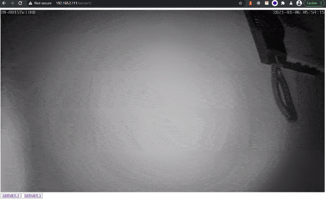

# INSTAR IP Camera HTML5 Video Stream

## How to use with an URL Prefix

### Prepare the HTML

Start by cloning this repository to `/opt/html5_video_prefix` and start editing the 3 `index.html` files inside the public directory for __server1__ - __server3__:


```bash
/opt/html5_video_prefix
├── conf
│  └── default.conf
├── docker-compose.yml
└── public
   ├── server1
   │  ├── index.html
   │  └── js
   ├── server2
   │  ├── index.html
   │  └── js
   ├── server3
   │  ├── index.html
   │  └── js
```


Add your camera [IP, HTTP Port and Login](https://wiki.instar.com/en/Advanced_User/Website_Integration/HTML5_Stream_Full_HD_Cameras/):


```html
<!-- this is the video the video element -->
<canvas id="activeVideo" width="1280" height="720"></canvas>

<script>
    
    var cam_host     = '192.168.2.122'; // DDNS or local ip
    var cam_port     = 80; // http port

    var cam_user     = 'admin'; // credentials for guest account recommended
    var cam_pass     = 'instar'; // credentials for guest account recommended

    var cam_stream   = 11; // 11 = FullHD; 12 medium res, 13 small res

    var canvas = document.getElementById("activeVideo");
    
    var player = null;
    
    function startvideo(cam_host, cam_port, cam_stream, cam_user, cam_pass){
        // init video player
        player = new HxPlayer();
        self.player.init({canvas:canvas,width:640,height:352});

        // play video
        player.playvideo(cam_host, cam_port, cam_stream, cam_user, cam_pass);
    }

    function stopvideo(){
        // stop video
        player.stopvideo();
        player = null;
    }
    
    
    // initialize and play video
    
    startvideo(cam_host, cam_port, cam_stream, cam_user, cam_pass)
    
    

</script>
```


### Run your Webserver

Run the `docker-compose` file from this repository:


```bash
version: "3.8"
services:

    ingress:
        image: nginx:stable-alpine
        container_name: ingress
        networks:
            - gateway
        ports:
            - "80:80"
        restart: unless-stopped
        volumes:
            - /opt/html5_video_prefix/conf/default.conf:/etc/nginx/conf.d/default.conf
            - /opt/html5_video_prefix/public:/opt/html5_video_prefix/public

networks:
  gateway: {}
```

This will pull the latest NGINX image from DockerHUB and mount your HTML code as well as a simple NGINX server configuration file:


```conf
server {
    listen       80;
    listen  [::]:80;
    server_name  localhost;

    location / {
        rewrite   ^/(.*)$  /server1/$1  permanent;
    }

    location /server1 {
        autoindex on;
        root  /opt/html5_video_prefix/public;
    }

    location /server2 {
        autoindex on;
        root  /opt/html5_video_prefix/public;
    }

    location /server3 {
        autoindex on;
        root  /opt/html5_video_prefix/public;
    }
    
    error_page   500 502 503 504  /50x.html;
    location = /50x.html {
        root   /usr/share/nginx/html;
    }
}
```


```bash
docker-compose up

Creating network "html5_video_prefix_gateway" with the default driver
Creating ingress ... done
Attaching to ingress
ingress    | /docker-entrypoint.sh: /docker-entrypoint.d/ is not empty, will attempt to perform configuration
ingress    | /docker-entrypoint.sh: Looking for shell scripts in /docker-entrypoint.d/
ingress    | /docker-entrypoint.sh: Launching /docker-entrypoint.d/10-listen-on-ipv6-by-default.sh
ingress    | 10-listen-on-ipv6-by-default.sh: info: IPv6 listen already enabled
ingress    | /docker-entrypoint.sh: Launching /docker-entrypoint.d/20-envsubst-on-templates.sh
ingress    | /docker-entrypoint.sh: Configuration complete; ready for start up
```


You can now access the web service on your server IP address, e.g.:


```bash
http://192.168.2.111/server1/
http://192.168.2.111/server2/
http://192.168.2.111/server3/
```


